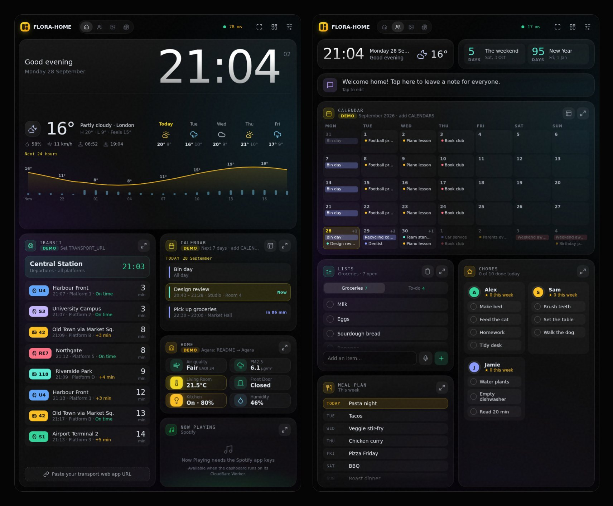

# FLORA-HOME

**A family smart display that runs on your own Cloudflare account.** Clock, weather, calendar, shared lists, chores, meal plan, transit, music and smart-home tiles on one dark, glassy dashboard. It's a plain web app, so it works on any device with a browser, and **your data never leaves your Cloudflare account.**

[](https://deploy.workers.cloudflare.com/?url=https://github.com/roadaddict/oh-my-dash)

   



*Home and Family screens at 800×1333, the portrait tablet size it's tuned for. Demo data; the sample widgets are marked **Demo** until you connect real sources.*

**Contents:** [Live demo](https://roadaddict.github.io/oh-my-dash/?local=1) · [Quick start](#-first-10-minutes) · [What you get](#what-you-get) · [Where it works](#where-it-works) · [Privacy & your data](#privacy--your-data) · [How sync works](#how-sync-works) · [Cloudflare setup](#cloudflare-setup) · [Calendar](#-google-family-calendar) · [Lists](#-lists-tablet-phones-voice) · [Spotify](#-spotify-now-playing--your-playlists) · [Commute](#-commute-public-transport-car-bike-on-foot) · [Strava](#-strava-your-familys-stats) · [Aqara](#-aqara-sensors-with-google-home) · [Tablet](#-tablet-fully-kiosk-browser) · [Configure](#configure) · [Secrets](#-secrets-api-keys) · [Develop](#local-development) · [Contribute](CONTRIBUTING.md)

---

## 🚀 First 10 minutes
*Ten minutes, if Cloudflare hasn't moved the buttons again.* You need a Cloudflare account and an email to sign in with. Just curious? Try the **[live demo](https://roadaddict.github.io/oh-my-dash/?local=1)** (sample data; anything you change stays in your browser), or open `public/index.html` locally.

**Pick one:**

**A. Fork** (auto-deploys on every push; *Sync fork* brings you updates)
1. **Fork this repo.**
2. **Cloudflare → Workers & Pages → Create → Import a repository** → your fork. Name the Worker **`oh-my-dashboard`** (must match `wrangler.jsonc`); keep the default deploy command.
3. **Storage & Databases → D1 → Create**, then bind it as **`DB`** (Worker → Settings → Bindings). No schema needed.

**B. No GitHub copy** (deploy from your machine, needs Node.js)
```bash
git clone https://github.com/roadaddict/oh-my-dash my-dashboard && cd my-dashboard
npx wrangler login
npx wrangler deploy   # creates the Worker and a D1 database bound as DB
```
Update later with `git pull && npx wrangler deploy`.

**Then, either way:**

4. **Zero Trust → Access → Applications → Self-hosted** → your Worker's hostname, with a policy for your family's emails. Until this exists, the API refuses everyone.
5. Put that application's **team domain** and **AUD tag** into the Worker's variables `ACCESS_TEAM_DOMAIN` and `ACCESS_AUD` (Worker → Settings → Variables and Secrets).
6. Open `https://oh-my-dashboard.<you>.workers.dev/`, sign in, admire your very expensive-looking clock. Spotify, Strava, Aqara & co. are optional, in the ⚙ drawer.

More detail in [Cloudflare setup](#cloudflare-setup).

---

## Why FLORA-HOME
- 🔒 **Your data stays in your Cloudflare account.** Settings, lists, chores, meals and layouts live in *your* D1 database, behind *your* Cloudflare Access login. No third-party backend, no sign-up with the author, no analytics or telemetry. See [Privacy & your data](#privacy--your-data).
- 🌍 **Cross-platform.** A web app, not a native app: it runs in any modern browser on a tablet, smart display, TV, phone or computer. See [Where it works](#where-it-works).
- 🔄 **Family sync.** Open the same URL on every device and lists, chores, the meal plan, notes and settings stay in step (about 15 s).
- 🧩 **Yours to arrange.** Four swipeable screens and a tiling-style layout editor (▦): drag, swap, add or remove any widget, per device and orientation.
- 🪶 **Light and simple.** Vanilla JS in one `public/index.html` (built from small per-widget files, no framework) plus a small Worker. Widgets poll only while visible, so it's gentle on a home connection ([numbers](#-bandwidth)).
- 🔌 **Plugs into what you use:** Google Calendar and iCal, Spotify, Strava, Aqara sensors, public transport (VBB, Transitous), TomTom, Home Assistant and more; all optional.

## What you get

| Screen | What's on it |
|--------|--------------|
| **Home** | Transit board · clock + weather · agenda · Spotify **Now Playing** (+ your playlists on any speaker) · **Aqara** sensor tiles with outdoor air quality + PM2.5 |
| **Family** | Month calendar · shopping/to-do lists · chore chart with stars · meal planner · family note · countdowns |
| **Frame** | Full-screen photo slideshow (Ken Burns) with a big clock, weather, agenda and a news ticker on top |
| **Info** | Headlines · hourly weather, sunrise/sunset, UV, moon · crypto/stocks · **planes overhead** (live radar + routes) · commute · world clocks · quote · custom data |

Switch screens by tapping the tabs, swiping, or with the ← → keys. You can also let them **auto-rotate**, or **schedule** them by time of day.

<details>
<summary><b>Look & feel, weather, and the layout editor</b> (design notes and how the ▦ editor works)</summary>

**Look & feel:** near-black (`#050505`) with faint glass, film grain, Outfit / JetBrains Mono type and a BVG-yellow accent. It matches the [transit app](https://oh-my-bussy.vercel.app/), which runs chrome-free in the Transit slot. Tuned around a typical **10" Android tablet** (e.g. Nokia T21/T20), primarily **portrait** (800×1333 CSS px: clock + weather across the top, the transit app down the full left side, calendar · sensors · Now Playing on the right). Landscape works too (1333×800, or 1000×600 at 2× density, where Info switches to a roomier *short* layout).

**Weather:** one shared component (Home clock and Info panel) with a single, calm hierarchy: the current conditions (icon, temperature, sky · place, high/low/feels-like), one quiet line of facts (humidity, wind, sunrise/sunset, UV, moon), the yellow temperature line with rain-chance bars, and **tappable forecast days** (tap → that day's hours; back to "next 24 h" after a minute). It adapts to its box instead of having per-tab variants. Tall boxes get Apple-style day rows with temperature-range bars, wide boxes get current conditions beside the chart, and short boxes (Info) get compact days next to the current conditions. On Home, the clock sits above it, with the greeting and date beside it when there's width. Units are metric by default (°C, km/h, km, m).

**Edit layout (▦ button):** every screen is a tree of splits, like a tiling window manager, so each column sizes its own widgets. Drag a yellow handle and only the two widgets it separates change size; the handle pushes on through the next widget in that column once one hits its minimum. **Tap two widgets to swap them** (any two, whatever their size; the transit app isn't reloaded). **Change** on a widget swaps in any widget from any screen, including ones no screen uses yet, and *Restore* brings the original back. Layout changes belong to **this device and this orientation**: resizing, swapping or hiding a header on the laptop in landscape never touches the tablet, or the laptop in portrait. They're kept in the cloud per device (so they survive a browser reset) but never applied to another device; a browser that has never opened the dashboard starts from the default layouts. Each main column is outlined and has a **− n rows +** control on its bottom edge (0–4 widgets; + asks which widget and adds it at the bottom, 0 removes the column); the edit bar has the same control for the screen's full-width rows, and every widget has **Add right / Add below / Remove**, so any widget can go on any screen. The widget picker is grouped (Time & weather, Family, Photos/music/news, Getting around, Home & web, Fitness & markets). Handles snap to a 10 px grid, so edges in different columns line up. The small **Header** switch in each widget's top-right corner hides or shows its title bar (this device, this orientation). While editing, **tap the dashboard name** in the status bar to rename it (also ⚙ → Status bar). *Reset screen* restores the default for this screen, on this device, in this orientation. Widgets refresh themselves, so they have no Reload button; an amber **Retry** appears only while a widget's data can't be loaded (embedded pages like the Google Calendar embed keep Reload). The top of ⚙ Settings has **Widget background**: 0 · 5 · 10 · 15 · 20 % (0 = no background, 20 = the frosted glass, default), and **Photos behind the widgets** (the Photos slideshow on every screen). Both preview live.

</details>

## Where it works
It's a web app served by your own Worker, so anything with a modern browser can show it. Nothing to install on the device.

| Device | How to use it | Notes |
|---|---|---|
| **Wall-mounted tablet, smart display or TV** (the main use case) | Open the URL in a browser, full-screen. On Android, [Fully Kiosk Browser](#-tablet-fully-kiosk-browser) makes it a proper kiosk | Any screen size works; the layout is tuned for a 10" tablet (portrait 800×1333, or landscape) and adapts to others. |
| **Phone** | Open the URL in the browser, then *Add to Home Screen* | Great as a remote for lists, chores and settings. |
| **Laptop, desktop or Raspberry Pi** | Open the URL in any current browser (full-screen mode for a kiosk) | Plain HTML/JS, so it should work in current Chrome, Edge, Firefox and Safari. Mostly checked on Chrome-based browsers; report anything odd. |

Some extras depend on the browser: voice input for lists uses the browser's speech recognition (Chrome on Android 13+ and desktop; other browsers fall back to the keyboard's own mic). The backend (sync, Spotify, Aqara, the feed proxy) needs the Cloudflare Worker; without it the page still runs in *local mode*.

## Privacy & your data
**Short version:** the project has no server of its own. Everything runs in your Cloudflare account, and nobody else, including the author, gets your data.

**What is stored, and where**
| Data | Stored in |
|---|---|
| Settings, layouts, lists, chores, meal plan, family note | **Your D1 database** |
| Spotify, Strava and Aqara sign-in tokens | A private table in **your D1 database**; only the Worker reads it, and it is never sent to browsers |
| Per-device data-usage summaries (for ⚙ → *Data usage*) | Your D1 database |
| Who can open the dashboard | **Your Cloudflare Access** policy (or an `ALLOWED_IPS` list); the API refuses every request until one is configured |
| Device-only state (local mode, the widget cache, photos cache) | That device's browser storage |

**What leaves your account.** The dashboard needs live data, so the browser or your Worker calls public services, but only the ones your widgets use:
- **Weather and air quality** ([Open-Meteo](https://open-meteo.com/)): your configured coordinates.
- **Place search and routing** (OpenStreetMap Nominatim, Photon, OSRM): the addresses you type into ⚙ → Commute; **transit** (VBB, Transitous), **planes** (adsb.fi, adsb.lol, adsbdb), **markets** (CoinGecko, Finnhub), **holidays** (Nager.Date) and **sports** (ESPN): the queries needed for those widgets.
- **News, calendars and photos:** whatever feeds and links *you* add. In cloud mode, feeds are fetched through your own Worker proxy.
- **Spotify, Strava, Aqara, TomTom, Todoist, Google Calendar embeds:** only if you connect them, and then they see what those services normally see.
- **Page assets:** the browser loads fonts from Google Fonts and the calendar libraries from jsDelivr. Opening the phone-lists QR code sends that page's URL to api.qrserver.com to draw the code.
- **Cloudflare itself** naturally sees the traffic to your Worker and handles the Access login, as with any Cloudflare-hosted site.

**What it does not do:** no analytics, no telemetry, no ads, no account with the author, and nothing is reported back to the author or this repository.

**You stay in control.** ⚙ → *Backup & access* has **Download backup** and **Restore**. Deleting the Worker and its D1 database removes everything. The code is MIT-licensed and small enough to read, so you can check all of this yourself.

## How sync works
- On load, the page calls `/api/state`. If it answers, the dashboard runs in **cloud mode**:
  - **Settings (⚙):** stored in D1. Saving on any device reloads every screen within ~15 s.
  - **Lists, chores, meals and the note:** synced to D1, polled every 15 s. Each write carries a revision number. If two people edit at once, the second write is re-applied on top of the first, so nothing is overwritten.
  - **Feeds (iCal, RSS, Google Photos, live flight data):** go through the same-origin `/api/proxy`, so no CORS setup is needed.
  - **Everything due at the same moment comes in one request:** feeds share one clock, and with the Worker the tablet sends them together to `/api/proxy/batch` (weather, calendars, news …). The Worker fetches them in parallel and caches them at the edge for every screen in the house. A host that `ALLOWED_HOSTS` leaves out is fetched directly by the tablet.
- If there's no backend (`file://`, other static hosts) or you aren't signed in, it runs in **local mode**: everything is stored on that device. The ⚙ drawer header says which mode you're in.

<details>
<summary><b>Repository layout</b></summary>

```
repo/
├── app/                        ← the dashboard's source (npm run build → public/index.html)
│   ├── index.html              ← page skeleton
│   ├── config.js               ← your own defaults and screens (OMD.configure)
│   ├── core/                   ← screens, layout editor, settings, sync, widget host, shared UI
│   └── widgets/<name>/         ← one folder per widget: widget.js (+ widget.css)
├── public/index.html           ← GENERATED: the whole dashboard in one file (also works from file://)
├── src/worker.js               ← Cloudflare Worker: /api/* → API, everything else → public/
├── lib/api.js                  ← API routes: /api/health, /api/state[/:key], /api/proxy[/batch], /api/<integration>/…
├── lib/auth.js                 ← Cloudflare Access login verification + home-IP allow-list
├── lib/http.js                 ← D1 table setup + helpers
├── lib/secrets.js              ← private D1 table for integration tokens (never sent to browsers)
├── lib/integration-host.js     ← runs each integration with only its own env vars and token rows
├── lib/integrations/           ← one file per backend integration (auto-registered):
│                                  spotify, aqara, strava, todoist, finnhub, tomtom
├── scripts/                    ← build (npm run build) and lint checks
├── test/                       ← unit tests (npm test) and browser tests (npm run test:e2e)
├── wrangler.jsonc              ← Worker config (name, assets, D1 binding, Access vars)
└── cors-proxy/worker.js        ← only needed if you host the page somewhere other than Cloudflare
```

</details>

---

<a id="cloudflare-setup"></a>
## ☁️ Cloudflare setup (Workers)

Cloudflare's "Import a repository" flow creates a **Worker with static assets**. `wrangler.jsonc` in the repo describes everything, so the dashboard steps are short:

1. **D1 database:** Storage & Databases → D1 → Create. You don't need a schema; the API creates its table on first use.
2. **Worker from Git:** Workers & Pages → Create → Import a repository → `roadaddict/oh-my-dash`.
   - The Worker must be named **`oh-my-dashboard`** (it has to match `name` in `wrangler.jsonc`).
   - Deploy command: `npx wrangler deploy` (the default).
   - Production branch: the branch you deploy from (e.g. `main`).
3. **Bind the database:** Worker → Settings → Bindings → D1 → variable name **`DB`**. `wrangler.jsonc` has a binding-only entry for `DB`, so deploys keep using the database you bound here.
4. **Cloudflare Access:** Zero Trust → Access → Applications → Self-hosted → the Worker's hostname (`oh-my-dashboard.<you>.workers.dev`, or a custom domain).
   - **Policy "Family":** Allow · Emails → everyone's Gmail addresses. One-time PIN login works out of the box.
   - **Session duration:** the longest option, so phones stay signed in.
   - **Policy "Home tablet" (optional):** Bypass · IP ranges → your home public IP. The tablet then never sees a login page.
5. **Access values:** the API verifies the Access login token using `ACCESS_TEAM_DOMAIN` and `ACCESS_AUD`. Set both as **dashboard variables** (Worker → Settings → Variables and Secrets): `ACCESS_TEAM_DOMAIN` = your team's `*.cloudflareaccess.com` domain, `ACCESS_AUD` = Access → your application → Overview → "Application Audience (AUD) Tag". They aren't secret (both appear in every Access login redirect), but they're specific to *your* Access application, so they're kept out of `wrangler.jsonc` and never committed. `keep_vars` in `wrangler.jsonc` preserves them across deploys.
6. **Only if you use the Bypass policy:** Worker → Settings → Variables → add **`ALLOWED_IPS`** = the same home IP(s) (comma-separated IPs or CIDRs). **Yes, this is needed even with the Bypass policy:** Access lets bypassed requests through *without* a login token, so the Worker can't tell your tablet from anyone else and refuses the API. Your current public IP is shown in ⚙ → *Backup & access* and in `/api/health` (`"ip"`). If you'd rather not maintain an IP, skip Bypass and sign the tablet in once instead. `keep_vars` in `wrangler.jsonc` preserves it across deploys. Optionally add `ALLOWED_HOSTS` to restrict the feed proxy.
7. **Check it:** open `https://<worker-host>/api/health` → `{"authorized":true,"db":true,…}`. ⚙ should say *"Synced via Cloudflare"*.

The API refuses every request until Access (or `ALLOWED_IPS`) is configured; it's secure by default.

> If your ISP changes your home IP, the tablet will hit the Access login page. Update the Bypass policy and `ALLOWED_IPS`, or sign the tablet in once with its own email; it then stays signed in for the session duration.

---

## 📅 Google Family calendar
Google doesn't provide an iCal link for the Family calendar, so the dashboard shows Google's own embed, auto-inverted to dark:
1. **calendar.google.com → ⚙ Settings → (left) Family → Integrate calendar → Calendar ID**, e.g. `family0123…@group.calendar.google.com`
2. On the dashboard: **⚙ → Calendar → "Google calendar ID(s)"** → paste it. Add more IDs separated by commas.
3. On the tablet, **sign in to a family Google account inside the kiosk browser** (open `accounts.google.com` once), and allow **third-party cookies** (in Fully Kiosk: Settings → *Web Content Settings*; the exact wording varies by version). Without these the embed shows "you do not have permission to view".

Each calendar panel opens in its own mode (month on Family, agenda on Home and Frame), and its view button cycles through agenda, week and month.

## 📝 Lists: tablet, phones, voice
**On the tablet:** type several items at once with commas ("milk, eggs, bread"). Nothing is duplicated, and re-adding a ticked item reopens it. Things you add often appear as **quick-add chips** on a tall Lists widget or a big screen, so you rarely need the keyboard. Tap to tick, **hold to delete** (with Undo), 🗑 clears ticked items.

**Voice:** 🎤 → say "milk and bread, eggs" → three items ("and", "und", commas split them). Tap 🎤 again to stop. It uses the browser's speech recognition (Chrome on Android 13+ and desktop). In a kiosk browser: allow the microphone for the dashboard (Fully Kiosk: *Web Content Settings*); if the kiosk browser has no speech service, the mic says so once and from then on opens the keyboard, whose own 🎤 (Gboard voice typing) works everywhere.

**On your phones:** tap the 📱 button on the Lists widget and scan the QR code. It opens `…/?view=lists`, a lightweight, full-screen version of the lists (nothing else loads). Sign in with your family email once, then use Chrome's menu → **Add to Home screen**. Changes reach the tablet within ~15 s, and the phone refreshes as soon as you switch back to it.

**Voice / share-sheet shortcuts (optional):** `POST /api/lists/add` with `{"text": "milk, eggs", "list": "Groceries"}` adds items with the same rules; `GET /api/lists` returns open items. Shortcuts can't do a browser login, so give them a Cloudflare Access **service token**: Zero Trust → Access → Service Auth → *Create service token*, then add a *Service Auth* policy with that token to the dashboard's Access application. Send its two values as the `CF-Access-Client-Id` and `CF-Access-Client-Secret` headers.
- *iPhone:* Shortcuts app → "Dictate text" → "Get contents of URL" (POST, JSON body, the two headers) → name it "Add to groceries" and say it to Siri.
- *Android:* the free **HTTP Shortcuts** app can send the same request from a home-screen button, a text prompt, or the **share sheet** (share text from any app into the list).

## 🎵 Spotify: Now Playing + your playlists
Shows what's playing on any of your Spotify Connect devices (Google Home / Nest speakers included), with previous / play-pause / next, a **speaker picker**, and a **playlist picker** that starts one of *your* playlists on the chosen speaker. Tokens stay on the Worker.

1. [developer.spotify.com/dashboard](https://developer.spotify.com/dashboard) → **Create app** → Web API. Redirect URI: `https://oh-my-dashboard.<you>.workers.dev/api/spotify/callback` (your exact hostname).
2. Worker → Settings → Variables and Secrets → add `SPOTIFY_CLIENT_ID` (text) and `SPOTIFY_CLIENT_SECRET` (**secret**).
3. On any signed-in device: ⚙ → **Accounts** → *Connect Spotify* → approve. Every screen uses that account from then on.
4. Optional: ⚙ → Widgets → *Smart home, Spotify…* → *Default Spotify speaker* (e.g. `Living Room speaker`). Without it, the dashboard asks the first time and remembers the choice per screen.

**Volume:** the speaker button next to ⏭ swaps the progress bar for a volume slider (it steps back after 5 s); it's hidden for speakers Spotify can't change the volume of.

Notes: Spotify's development mode needs the **app owner to have Premium** and allows up to 5 listed users (App → Settings → User management; add the account you connect with). Playback control needs Premium. A Google Home speaker appears in the list only after it has recently played Spotify ("Hey Google, play Spotify" once wakes it up). Polling: every 10 s while playing, every 30 s when idle, only while the Home screen is showing.

## 🚆 Commute: public transport, car, bike, on foot
⚙ → **Commute** → *Add destination*: a name, an address (suggestions appear as you type, and the place it found is confirmed underneath), **how** you go, and optionally a start other than home.
- **Public transport:** the next connection leaving now, with lines ("U5 → S3"), when to leave ("leave in 4 min") and live delays or cancellations. It uses VBB (Berlin/Brandenburg) and falls back to Transitous (open, Europe-wide) elsewhere.
- **Car:** live traffic ("+7 min traffic") needs a free TomTom key: developer.tomtom.com → sign up → "My first API key", saved as the Worker secret `TOMTOM_KEY` ([Secrets](#-secrets-api-keys)). That's 2,500 requests a day; the widget uses about 100. Without a key it shows typical drive time.
- **Bike / on foot:** OpenStreetMap routing.

It refreshes every 5 minutes while visible (⚙ → Commute → *Refresh*). Each row shows minutes door to door and the arrival time. Existing `COMMUTES` lines keep working; the new format is `Name | address | public·car·bike·foot | from (optional)`.

> ℹ️ The routing/geocoding (OpenStreetMap/Nominatim, OSRM), transit (VBB, Transitous) and plane-radar (adsb.fi/adsb.lol, adsbdb) APIs above are free, shared community services with fair-use limits, not paid accounts. The dashboard's default refresh rates (5 min for commute, 15 s for planes, one request per widget per household) are tuned to stay well within them; avoid setting refresh intervals much shorter, especially across several devices.

## 🏃 Strava: your family's stats
One card per person: **this week's distance**, a Mon–Sun bar chart (today highlighted), per-sport totals, the **last 4 weeks** and **this year**, and the latest activity. The header says who leads the week. It adapts to its slot: a short slot shows one line per person. Add it anywhere via ▦ → **Change** / **Add** → *Strava*.

1. [strava.com/settings/api](https://www.strava.com/settings/api) → create an app (any name/website). **Authorization Callback Domain:** `oh-my-dashboard.<you>.workers.dev` (just the host).
2. Worker → Variables and Secrets: `STRAVA_CLIENT_ID` (text) and `STRAVA_CLIENT_SECRET` (**secret**).
3. ⚙ → **Accounts** → Strava → **Connect a person**, once per household member (each signs in to their own Strava).

**If the second person's sign-in fails:** new Strava API apps are often limited to **one connected athlete** (the app owner). Either request a higher athlete capacity from Strava (developer program form), or let another household member create their own app (step 1, logged in as them) and add its keys as `STRAVA_CLIENT_ID_2` / `STRAVA_CLIENT_SECRET_2`. A second button, *Connect via app 2*, then appears.

Notes: private activities count too (the `activity:read_all` scope). Only the numbers reach the screens; tokens stay on the Worker. Stats refresh every 15 min while the widget is visible (about 1 KB per person). Limit the sports with ⚙ → *Strava: sports to count*, e.g. `Run, Ride`.

## 🏠 Aqara sensors (with Google Home)
Google Home has no public API for reading sensors, so the dashboard reads them from the **Aqara cloud**. That works for Aqara devices paired to an **Aqara hub / the Aqara Home app**, including ones you also linked to Google Home. Sensors paired *only* to Google Home over Matter/Thread never reach the Aqara cloud; re-pair them to an Aqara hub (and share them to Google Home via Matter) to see them here.

1. [developer.aqara.com](https://developer.aqara.com) → sign up → **Console → Project management → Create project**. Note the **App ID**, **Key ID** and **App Key**. Add the redirect URI `https://oh-my-dashboard.<you>.workers.dev/api/aqara/callback`.
2. Worker → Variables and Secrets: `AQARA_APP_ID`, `AQARA_KEY_ID` (text), `AQARA_APP_KEY` (**secret**), and `AQARA_REGION` if your Aqara account isn't in Europe (`USA`, `CN`, `KR`, `RU`, `SG`; default `GER`).
3. ⚙ → **Accounts** → *Connect Aqara* (Aqara sign-in page). If that page doesn't work for your project, use the fallback right below it: enter your Aqara account e-mail/phone → *Send code* → enter the code → *Verify*.

The Home panel then shows real tiles: temperature + humidity, doors/windows (open = red), motion, leaks, light level, with a small battery warning at ≤ 15 %. **Outdoor air quality** (European AQI: Good → Extremely poor) and **PM2.5** sit alongside them, from Copernicus CAMS via Open-Meteo (no key, one request per 30 min), and turn red at *Poor* or worse. They also show next to the demo tiles before Aqara is connected. Open doors and leaks sort first; expand the panel to see all sensors. Readings are cached for 60 s on the Worker (`AQARA_REFRESH_SEC` on the dashboard). If a model shows nothing, `/api/aqara/raw` lists the raw resource values to map.

## 💾 Do settings survive a redeploy?
Yes. In cloud mode, settings, lists, chores, meals, the note and layouts live in **D1**, and account tokens in D1's private `secrets` table; a deploy replaces only code. `keep_vars` keeps the variables you add in the dashboard (`ALLOWED_IPS`…), and secrets are never touched by deploys.
What *can* look like a reset: a device that saved settings while it was in **local mode** (before the Worker/API existed, or while not signed in) kept them in that browser only. The dashboard now uploads such on-device settings and lists **once**, automatically, when the cloud has none. For peace of mind: ⚙ → *Backup & access* → **Download backup** / **Restore**, and D1 keeps 30 days of point-in-time history (`npx wrangler d1 time-travel restore <database> --timestamp=…`).

## 📱 Tablet: Fully Kiosk Browser
*Optional, Android-only. The dashboard itself needs no app: on any other device, just open the URL in a browser (and use Add to Home Screen / full-screen mode if you like).*

If your wall display is an **Android** tablet, use [Fully Kiosk Browser](https://www.fully-kiosk.com/) rather than a custom APK. PLUS is a one-time €7.90 per device and adds remote admin (reload, brightness, start URL, screenshots), plus the free basic tier of Fully Cloud.
- **Start URL:** `https://oh-my-dashboard.<you>.workers.dev/` (or your custom domain) (add `?START_SCREEN=frame` or other URL params for per-device tweaks)
- Turn on *Keep screen on*, *Autostart on boot*, *Fullscreen*, *Autoplay videos*, and third-party cookies (see above)
- On a typical 10" tablet (e.g. Nokia T21/T20): leave Fully's zoom at 100 %. If you prefer bigger text, 110–125 % still fits; the layout adapts to the smaller CSS viewport.
- **Remote config:** the dashboard's content and settings come from ⚙ on any family phone. Device-level control is Fully's remote admin.

---

## Configure
There are three ways to set values, listed from highest to lowest precedence:
1. **URL params**, per device: `?START_SCREEN=frame&LOW_POWER=1#family`
2. **⚙ settings drawer**, shared via D1 in cloud mode, otherwise per device
3. **`app/config.js`** (then `npm run build`): your own defaults, and screens of your own next to the built-in ones. Every setting's name and default is in its widget's folder (`app/widgets/<name>/widget.js`) or in `app/core/boot/00-defaults.js`.

List settings take one entry per line:
```
CHORES:       Alex | #34d399 | Make bed, Feed the cat
COMMUTES:     Work | 51.5155,-0.0922
DATA_WIDGETS: Solar | https://ha.example.com/api/states/sensor.solar | state | kW | Bearer eyJ…
```

> 🔐 API keys are never settings: they're **Worker secrets** (next section), so no screen, and no widget, ever sees them. A Home Assistant token in a data widget line is the exception: it lives in ⚙, which only signed-in family members can read.

## 🔐 Secrets (API keys)
Every service that needs a key is a **backend integration** (`lib/integrations/`): the key stays on the Worker, the screens only get the results, and each integration can read only the variables it declares and its own token rows in D1.

| Secret | For | Get it |
|---|---|---|
| `TODOIST_TOKEN` | a Todoist project as a tab of the Lists widget (⚙ → Lists → *Todoist project*) | Todoist → Settings → Integrations → Developer |
| `FINNHUB_TOKEN` | stocks in the Markets widget | free at finnhub.io |
| `TOMTOM_KEY` | live traffic for Commute by car | developer.tomtom.com → "My first API key" |
| `SPOTIFY_CLIENT_ID` / `_SECRET` | Now Playing | [Spotify](#-spotify-now-playing--your-playlists) |
| `AQARA_APP_ID` / `_KEY_ID` / `_APP_KEY` | sensors | [Aqara](#-aqara-sensors-with-google-home) |
| `STRAVA_CLIENT_ID` / `_SECRET` | Strava | [Strava](#-strava-your-familys-stats) |

Set one with `npx wrangler secret put TODOIST_TOKEN`, or in the Cloudflare dashboard: **Workers & Pages → oh-my-dashboard → Settings → Variables and Secrets → Add → Secret**.

**Upgrading from a version that kept Todoist / Finnhub / TomTom keys in ⚙:** add them as Worker secrets as above, then open ⚙ and press **Save**; the old copies are removed from the saved settings (the drawer points them out until then).

## 🔄 Is it auto-deploying?
**Workers & Pages → oh-my-dashboard → Settings → Build** should list the Git repository and branch (e.g. `main`), with deploy command `npx wrangler deploy`. Every push then shows up under **Deployments** with its commit message.
If no repository is connected, click **Connect** and pick the repo and branch, or deploy by hand from a checkout with `npx wrangler login && npx wrangler deploy`.
Check a deploy by opening `/api/health` in your (signed-in) browser: it should return JSON, not a 404.

**Recommended:** deploy only from `main` and turn off builds for other branches (Settings → Build → Branch control). Work then happens on branches and reaches the screens only when a PR is merged into `main`. Two people or sessions pushing to one deploy branch can't collide, and preview builds of feature branches (which fail without a `previews` block in `wrangler.jsonc`) don't queue up in front of the real deploy.

## 📶 Bandwidth
Everything is built to be light on a home connection. Measured on a 1333×800 tablet viewport:

| Screen | First load | Steady state |
|---|---|---|
| Home | ~0.1 MB + album art | ≈ 0.7 MB/h while music plays (a ~0.6 KB poll every 10 s + ~25 KB art per track), ≈ 0.1 MB/h idle; Aqara ≈ 0.1 MB/h. The transit app polls on its own. *(Estimates, not measured on the real APIs.)* |
| Family | ~10 KB | ~0 MB/h |
| Info | ~0.7 MB | ~1 MB/h (plane radar every 15 s) |
| Frame (photos) | ~0.1 MB | ~9 MB/h on the first pass through the photos; after that they come from Cache Storage (0 MB) |
| Status bar ping | — | ~0.05 MB/h (a bodiless request to your own Cloudflare edge every 30 s) |

**Keeping an eye on it:** ⚙ → *Data usage* shows this device's usage (today, last hour, average and peak kbit/s, requests/min, 7-day bars, top sources), plus a table of **every device's** report (each posts a summary to D1 every 15 min). Traffic inside iframes (transit app, Spotify, Google Calendar) is invisible to a web page; Android's *Settings → Network & internet → Internet → Non-carrier data usage* has the full per-app total.

How it stays light:
- Widgets and photos **only poll while their screen is showing**, and catch up when shown again. Night mode *off*/*clock* pauses everything.
- **Sync polling** uses ETags: an unchanged `/api/state` is a bodiless `304`.
- **Iframes are never force-reloaded** by default. They run their own update cycle and are reloaded only after the connection drops (`TRANSPORT_REFRESH_MIN` can opt in).
- Photos are capped at 1920 px, change every 60 s, and are stored in Cache Storage, so the loop never re-downloads, even across the daily reload. News refreshes every 30 min. Logos are reused, not re-requested.
- The status-bar ping hits `/api/ping` on your own Worker: answered at the nearest Cloudflare edge, reachable wherever the dashboard is, with no response body.
- The proxy edge-caches feeds (5 min by default; 5 s for live flight data).

## 🧩 Writing a widget
A widget is one folder, `app/widgets/<name>/`, with a `widget.js` and optionally a `widget.css`:

```js
OMD.defineWidget({
  id: 'mywidget', name: 'My widget', icon: 'star', group: 'Home & web',
  settings: [['MYWIDGET_URL', 'Data URL', 'url']],          // → its own section in ⚙
  defaults: { MYWIDGET_URL: '' },
  mount(ctx) {
    const p = ctx.panel({ tint: 'amber' });                  // the glass panel (↻ and ⤢ are automatic)
    const feed = ctx.feed(() => ctx.fetchJSON(ctx.settings.MYWIDGET_URL), 5 * 60000, { visibleOnly: true });
    ctx.subscribe(feed, (data) => p.body.replaceChildren(ctx.h('div', null, data?.value ?? '…')));
    p.onReload = () => feed.refresh();
  },
});
```
The picker, the settings drawer and the defaults are generated from that definition, so a new widget touches nothing outside its folder. Timers, listeners and feeds go through `ctx`: they stop when the widget is removed, and an error in one only replaces *that* widget with a "failed — Retry" card. **[CONTRIBUTING.md](CONTRIBUTING.md)** has the whole `ctx` API, the rules the linter checks, backend integrations and the tests; `app/widgets/example/` is a small widget to copy.

## Local development
```bash
npm install
npm run build:watch                       # app/ → public/index.html on every change
npx wrangler dev --var OPEN_API:true      # http://localhost:8787 (local D1), in a second terminal
npm run check                             # build, lint, format, unit and browser tests — what CI runs
```
`OPEN_API=true` disables API auth. **Never set it in production.** Deploying is unchanged: `public/index.html` is committed, so Cloudflare needs no build step.
